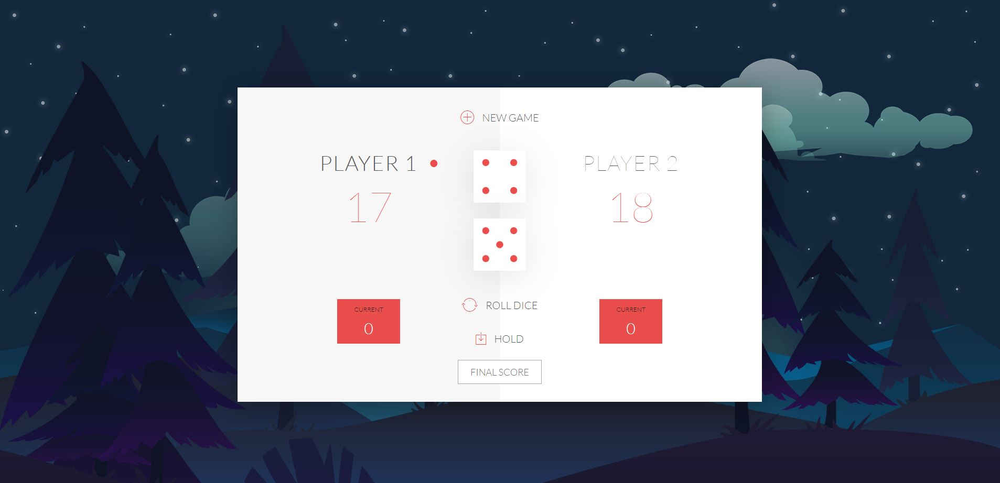

# Yahtzee Dice Game

A simple dice game based on classic Yahtzee built with JavaScript, DOM manipulation with Ionic library.

The application is inspired from [Udemy Course taught by Jonas Schmedtmann](https://www.udemy.com/the-complete-javascript-course/learn/lecture/5869260#overview). However, I have customized and made some changes based on my preferences.

### Completed:

Any user is able to play dice game with someone else, or with himself.
Score get reflected from the currect dices.
Basic rule: player rolls 2 dices at a time. If either dice is 1, the current player will lose all of the scores. If final score is not set, whoever gets 100 points first is the winner.
The background changes based on the day/night period.

### Screenshot:

## Prerequisites

Understanding of basic JavaScript and DOM.

### Installing

1. Clone the repo to your local machine \
   `$ git clone https://github.com/ngthu1995/Yahtzee-Dice`

2. Open index.html in the browser\

## Built With

JavaScript

## Author

Thu Nguyen - personal website: http://thunguyen.space/

## License

This project is licensed under ThuNguyen@2019.

## Acknowledgments

A big thank to all the articles from medium and helpful guide, support from people around me.
